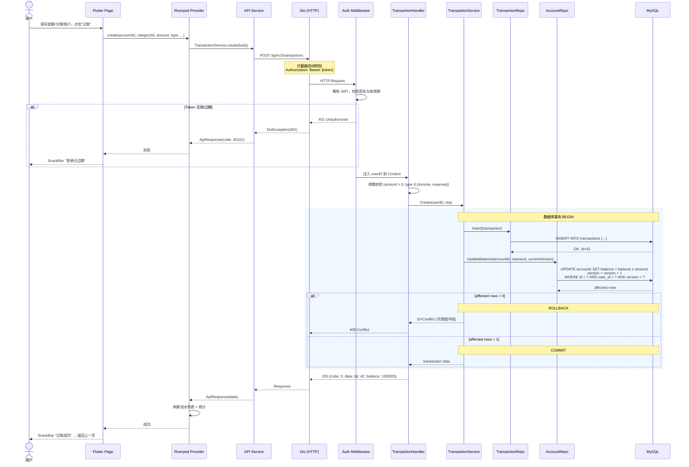
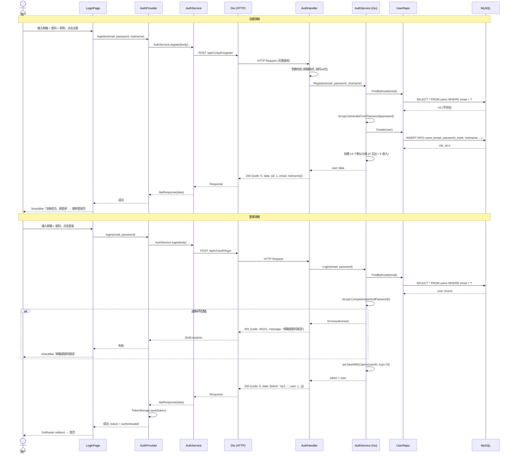
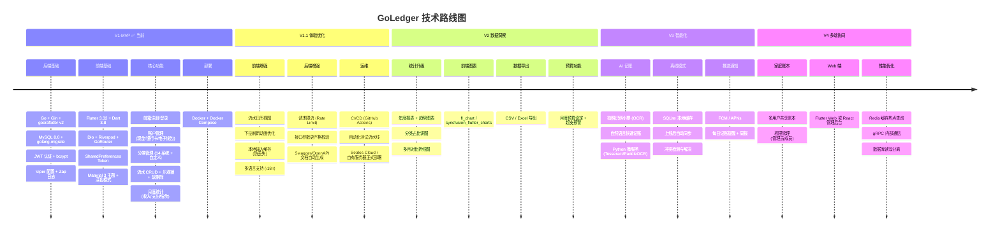

# GoLedger

**智能跨平台记账系统** — 代号 SyncFlow

GoLedger 是一款面向个人和家庭的记账应用，采用 Go 后端 + Flutter 前端的全栈架构。当前为 **V1-MVP** 版本，聚焦核心记账流程，以纯在线模式运行。

---

## 功能概览

| 模块 | 能力 |
|------|------|
| 👤 用户认证 | 邮箱注册 / 登录，JWT 鉴权（7 天有效期） |
| 💰 账户管理 | 支持现金、银行卡、电子钱包三类，余额随流水自动增减 |
| 🏷️ 分类管理 | 注册时自动创建 14 个系统分类（9 支出 + 5 收入），支持自定义扩展 |
| 📝 流水记录 | 收入 / 支出记录的增删改查，分页列表，乐观锁并发控制 |
| 📊 月度统计 | 按月汇总收入、支出、结余 |

## 技术栈

### 后端

| 职责 | 选型 |
|------|------|
| Web 框架 | [Gin](https://github.com/gin-gonic/gin) |
| 数据库查询 | [gocraft/dbr v2](https://github.com/gocraft/dbr)（非 ORM） |
| 数据库 | MySQL 8.0 |
| 数据库迁移 | [golang-migrate v4](https://github.com/golang-migrate/migrate) |
| 配置管理 | [Viper](https://github.com/spf13/viper) |
| 日志 | [Zap](https://go.uber.org/zap) |
| 认证 | [golang-jwt v5](https://github.com/golang-jwt/jwt) + bcrypt |

### 前端

| 职责 | 选型 |
|------|------|
| UI 框架 | [Flutter](https://flutter.dev) 3.32 / Dart 3.8 |
| HTTP 客户端 | [Dio](https://pub.dev/packages/dio) ^5.7 |
| 状态管理 | [Riverpod](https://pub.dev/packages/flutter_riverpod) ^2.6 |
| 路由 | [GoRouter](https://pub.dev/packages/go_router) ^14.6 |
| 本地存储 | [SharedPreferences](https://pub.dev/packages/shared_preferences) ^2.3 |

### 基础设施

- Docker + Docker Compose 一键部署
- 多阶段 Dockerfile 构建（最终镜像 ~20MB）

---

## 项目结构

```
GoLedger/
├── backend/
│   ├── cmd/server/          # 程序入口
│   ├── internal/
│   │   ├── config/          # 配置加载
│   │   ├── handler/         # HTTP 路由处理（5 个 handler）
│   │   ├── service/         # 业务逻辑层（5 个 service）
│   │   ├── repository/      # 数据访问层（4 个 repo）
│   │   ├── model/           # 数据模型（4 个 model）
│   │   ├── middleware/      # 中间件（Auth / Logger / CORS）
│   │   └── pkg/             # 公共工具（errs / response / jwt）
│   ├── migrations/          # SQL 迁移脚本（4 组 up/down）
│   ├── config.yaml          # 默认配置
│   ├── Dockerfile
│   └── docker-compose.yml
├── frontend/
│   └── lib/
│       ├── core/            # 常量 / Dio 封装 / Token 存储 / 路由
│       ├── models/          # 数据模型（5 个）
│       ├── services/        # API 服务层（5 个，对接 14 个接口）
│       ├── providers/       # Riverpod 状态管理（5 个）
│       └── pages/           # UI 页面（10 个）
├── api.md                   # 完整 API 文档（14 个接口）
└── require.md               # 产品需求文档
```

---

## 快速开始

### 前置条件

- [Docker](https://www.docker.com/) & Docker Compose
- [Flutter SDK](https://flutter.dev/docs/get-started/install) ≥ 3.32（仅前端开发需要）

### 1. 启动后端

```bash
cd backend
docker compose up -d
```

服务启动后，API 监听在 `http://localhost:8080`。MySQL 数据库会自动初始化并运行迁移脚本。

### 2. 运行前端

```bash
cd frontend
flutter pub get
flutter run
```

> 前端默认连接 `http://10.0.2.2:8080`（Android 模拟器代理到宿主机 localhost）。
> 如需修改，编辑 `frontend/lib/core/constants.dart` 中的 `baseUrl`。

---

## API 概览

共 **14 个接口**，完整文档见 [`api.md`](./api.md)。

| 方法 | 路径 | 说明 | 认证 |
|------|------|------|------|
| POST | `/api/v1/auth/register` | 用户注册 | ✗ |
| POST | `/api/v1/auth/login` | 用户登录 | ✗ |
| POST | `/api/v1/accounts` | 创建账户 | ✓ |
| GET | `/api/v1/accounts` | 账户列表 | ✓ |
| PUT | `/api/v1/accounts/:id` | 修改账户 | ✓ |
| POST | `/api/v1/categories` | 创建分类 | ✓ |
| GET | `/api/v1/categories` | 分类列表 | ✓ |
| PUT | `/api/v1/categories/:id` | 修改分类 | ✓ |
| POST | `/api/v1/transactions` | 创建流水 | ✓ |
| GET | `/api/v1/transactions` | 流水列表（分页） | ✓ |
| GET | `/api/v1/transactions/:id` | 流水详情 | ✓ |
| PUT | `/api/v1/transactions/:id` | 修改流水 | ✓ |
| DELETE | `/api/v1/transactions/:id` | 删除流水（软删除） | ✓ |
| GET | `/api/v1/stats/monthly` | 月度统计 | ✓ |


## 数据库设计

4 张核心表，所有金额字段使用 **BIGINT（单位：分）** 存储，避免浮点精度问题。

| 表名 | 说明 | 关键字段 |
|------|------|----------|
| `users` | 用户 | email (唯一), password_hash, nickname |
| `accounts` | 账户 | name, type (cash/bank_card/e_wallet), balance, version |
| `categories` | 分类 | name, type (income/expense), is_system |
| `transactions` | 流水 | amount, type, account_id, category_id, version, deleted_at |

**设计要点：**

- **乐观锁**：`accounts` 和 `transactions` 表含 `version` 字段，更新时 `WHERE version = ?` 并检查 affected rows
- **软删除**：`transactions` 表通过 `deleted_at` 字段实现，删除时自动回滚账户余额
- **无外键**：应用层保证引用完整性，简化运维和迁移
- **系统分类**：注册时自动创建 14 个分类（`is_system = 1`），不可删除

---

## 配置说明

后端配置文件 `backend/config.yaml`：

```yaml
server:
  port: 8080
  mode: debug          # debug | release

database:
  host: 127.0.0.1
  port: 3306
  user: root
  password: root
  name: goledger

jwt:
  secret: "change-me-in-production"
  expire_hours: 168    # 7 天
```

Docker Compose 部署时，数据库 host 会被环境变量 `DATABASE_HOST=mysql` 覆盖。

---

## 架构与设计

### 系统组件架构图

展示 Flutter 客户端（绿色）→ Go 后端（蓝色）→ MySQL（橙色）的完整分层与组件关系。所有数据库操作封装在 Repository 层，业务逻辑不直接接触 SQL，方便未来替换查询方案。

```mermaid
graph TB
    subgraph Client["📱 Flutter 客户端"]
        direction TB
        subgraph Pages["Pages 页面层"]
            LP["🔐 LoginPage<br/>RegisterPage"]
            HP["🏠 HomePage"]
            AP["💰 AccountListPage<br/>AccountFormPage"]
            CP["🏷️ CategoryListPage<br/>CategoryFormPage"]
            TP["📝 TransactionListPage<br/>TransactionDetailPage<br/>TransactionFormPage"]
        end

        subgraph Providers["Providers 状态管理"]
            AuthP["AuthProvider<br/><i>登录态 + Token</i>"]
            AccP["AccountProvider<br/><i>账户列表</i>"]
            CatP["CategoryProvider<br/><i>分类列表</i>"]
            TxP["TransactionProvider<br/><i>流水列表 + 分页</i>"]
            StP["StatsProvider<br/><i>月度统计</i>"]
        end

        subgraph Services["Services API 服务层"]
            AS["AuthService"]
            AcS["AccountService"]
            CaS["CategoryService"]
            TxS["TransactionService"]
            StS["StatsService"]
        end

        subgraph Core["Core 核心"]
            DIO["Dio + Auth 拦截器"]
            TS["TokenStorage<br/><i>SharedPreferences</i>"]
            RT["GoRouter<br/><i>路由守卫</i>"]
        end

        Pages --> Providers
        Providers --> Services
        Services --> DIO
        DIO --> TS
        RT --> TS
    end

    subgraph Server["⚙️ Go 后端  :8080"]
        direction TB
        subgraph Middleware["Middleware 中间件"]
            CORS["CORS"]
            LOG["Logger<br/><i>Zap</i>"]
            AUTH["Auth<br/><i>JWT 校验</i>"]
        end

        subgraph Handlers["Handlers 路由处理"]
            AH["AuthHandler<br/><i>register / login</i>"]
            AcH["AccountHandler<br/><i>create / list / update</i>"]
            CaH["CategoryHandler<br/><i>create / list / update</i>"]
            TxH["TransactionHandler<br/><i>CRUD + 软删除</i>"]
            StH["StatsHandler<br/><i>monthly</i>"]
        end

        subgraph Svc["Services 业务逻辑"]
            ASvc["AuthService"]
            AcSvc["AccountService"]
            CaSvc["CategoryService"]
            TxSvc["TransactionService<br/><i>事务 + 乐观锁</i>"]
            StSvc["StatsService"]
        end

        subgraph Repo["Repositories 数据访问"]
            UR["UserRepo"]
            AR["AccountRepo"]
            CR["CategoryRepo"]
            TR["TransactionRepo"]
        end

        Middleware --> Handlers
        Handlers --> Svc
        Svc --> Repo
    end

    subgraph Database["🗄️ MySQL 8.0"]
        U["users"]
        A["accounts"]
        C["categories"]
        T["transactions"]
    end

    DIO -- "HTTP/JSON<br/>14 个 RESTful API" --> CORS
    Repo --> Database
```



### 核心时序图 — 创建流水

展示系统最核心的业务流程：用户记一笔账时，数据如何在前后端各层之间流转，包括 JWT 鉴权、数据库事务、乐观锁冲突处理等关键路径。



---

## 开发相关

```bash
# 后端编译检查
cd backend && go build ./...

# 前端静态分析
cd frontend && flutter analyze

# 前端运行（Chrome）
cd frontend && flutter run -d chrome

# 前端运行（Android 模拟器）
cd frontend && flutter run
```

---

## 文档

| 文件 | 说明 |
|------|------|
| [`require.md`](./require.md) | 产品需求文档 |
| [`api.md`](./api.md) | API 接口文档（含完整请求/响应示例） |

---

## 认证时序图 — 注册与登录

展示用户注册（邮箱查重 → bcrypt 加密 → 创建默认分类）和登录（密码校验 → JWT 签发 → Token 本地持久化 → 路由跳转）的完整流程。



---

## 技术路线图

从 V1-MVP 到 V4 的演进规划。



---

## License

MIT
